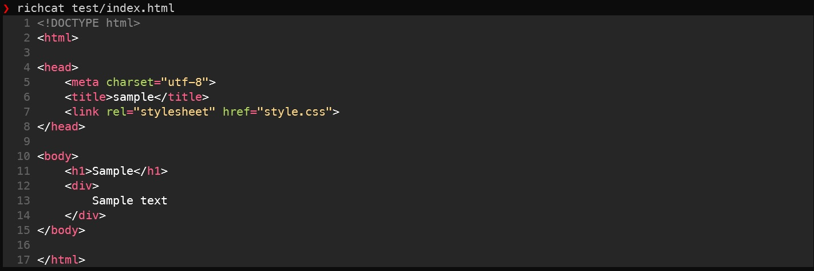
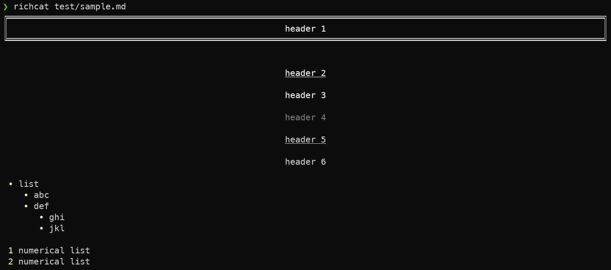
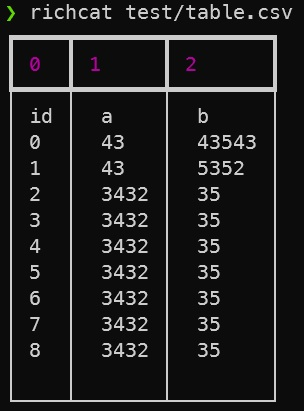

[](https://pepy.tech/project/richcat)
# richcat
- `richcat` is a `cat` command decorated by [rich](https://github.com/willmcgugan/rich) which is Python library.
- Working on Python.

## Features

### Syntax hilighting


### Support viewer

#### Markdown


#### CSV


### Automatic paging
By default, `richcat` pipes its own output to a pager. If you wouldn't rather pager, use `--disable-pager` option.

## Installation
```
$ pip install richcat
```

## Usage
Display a file contents on the terminal.
```
$ richcat README.md
```

Use `-t` option, you can choose highlight.
```
$ richcat README.md -t text
```

# Contributors!
- [@yamamoto-yuta](https://github.com/yamamoto-yuta) (Maintainer, **main contributor!**)
- [@ShotaroKataoka](https://github.com/ShotaroKataoka) (Maintainer)
